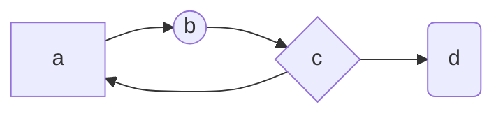

# 记录一些自己感兴趣的技术


### 技术栈
 - 后端: 
    - [Spring boot 2.3.1.RELEASE](https://spring.io/projects/spring-boot)  
    - [Apache Dubbo 2.7.7](https://dubbo.apache.org/en-us/)  
    - [HttpComponents 4.4.13](http://hc.apache.org/)  
    - .......
    
 - 中间件: 
    - [Mongodb 4.2](https://docs.mongodb.com/)  
    - [Zookeeper 3.6](https://zookeeper.apache.org/) 


姓名|技能|排行
--|:--:|--:
刘备|哭|大哥
关羽|打|二哥
张飞|骂|三弟
张飞|骂|三弟
张飞|骂|三弟
张飞|骂|三弟


```
    function fun(){
         echo "这是一句非常牛逼的代码";
    }
    fun();
```



```flow

st=>start: Start

op=>operation: Your Operation

cond=>condition: Yes or No?

e=>end

st->op->cond

cond(yes)->e

cond(no)->op

```


```flow

st=>start: Start|past:>http://www.google.com[blank]

e=>end: End:>http://www.google.com

op1=>operation: get_hotel_ids|past

op2=>operation: get_proxy|current

sub1=>subroutine: get_proxy|current

op3=>operation: save_comment|current

op4=>operation: set_sentiment|current

op5=>operation: set_record|current

cond1=>condition: ids_remain空?

cond2=>condition: proxy_list空?

cond3=>condition: ids_got空?

cond4=>condition: 爬取成功??

cond5=>condition: ids_remain空?

io1=>inputoutput: ids-remain

io2=>inputoutput: proxy_list

io3=>inputoutput: ids-got

st->op1(right)->io1->cond1

cond1(yes)->sub1->io2->cond2

cond2(no)->op3

cond2(yes)->sub1

cond1(no)->op3->cond4

cond4(yes)->io3->cond3

cond4(no)->io1

cond3(no)->op4

cond3(yes, right)->cond5

cond5(yes)->op5

cond5(no)->cond3

op5->e

```


